# Kernel-Patch 设计文档

## 目录

- [1. 设计概述](#1-设计概述)
- [2. 架构驱动因素](#2-架构驱动因素)
- [3. 分层架构](#3-分层架构)
- [4. 组件模型与交互](#4-组件模型与交互)
- [5. 时序与流程](#5-时序与流程)
- [6. 状态机与恢复模型](#6-状态机与恢复模型)
- [7. 脚本职责说明](#7-脚本职责说明)
- [8. 数据契约](#8-数据契约)
- [9. 测试与运维说明](#9-测试与运维说明)

## 1. 设计概述

`kernel-patch` 提供一个面向内核补丁迁移的可中断、可恢复、可审计工作流。系统不是简单包装一次 `git am`，而是围绕批量 patch 合入建立了显式状态、统一恢复入口和确定性 post-apply 校验闭环。

它覆盖的主路径如下：

1. 从源仓库导出指定 commit 的 `.patch`。
2. 在目标仓库测试分支顺序应用 patch。
3. 冲突时暂停并等待人工 `git am --continue`。
4. 对应用结果做结构化校验。
5. 对可修复差异执行有限次自动修复与复检。
6. 在全部 patch 完成后生成 review handoff 信息给 `patch-validator`。

### 1.1 架构定位

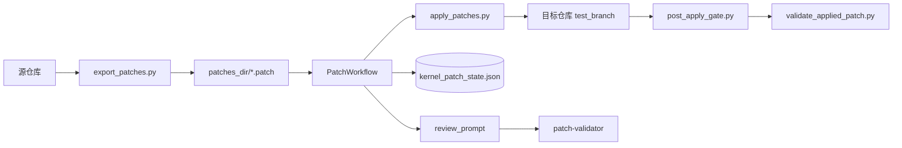

### 1.2 当前实现边界

- 批量 orchestrator 固定为 `scripts/run_patch_sets.py`
- 状态唯一事实来源是 `patches_dir/kernel_patch_state.json`
- patch 应用顺序严格按 `patch_set -> commit` 串行推进
- 自动修复只针对已定义可修复差异，最终语义正确性由 `patch-validator` 兜底

## 2. 架构驱动因素

### 2.1 业务驱动

- patch 顺序敏感，不能并发乱序应用
- 任务经常跨多轮对话，需要断点续跑
- 冲突、语义替代和 missing hunk 必须有显式人机协作关口
- 合入阶段结束后需要统一 review handoff，而不是直接宣告任务完成

### 2.2 技术驱动

- 脚本间通信使用稳定 JSON 契约
- 状态持久化必须可人工检查、可程序恢复
- 恢复入口要按 phase 严格门控
- 通用路径、git、配置和 CLI 能力统一沉到 `shared/*`

### 2.3 约束图

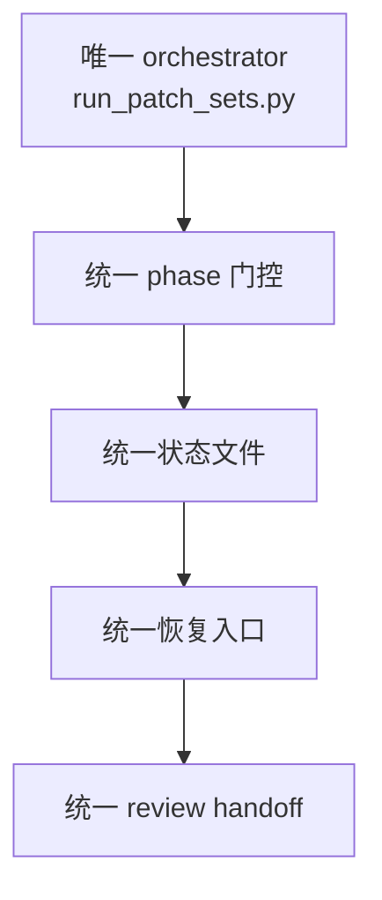

## 3. 分层架构

### 3.1 分层图

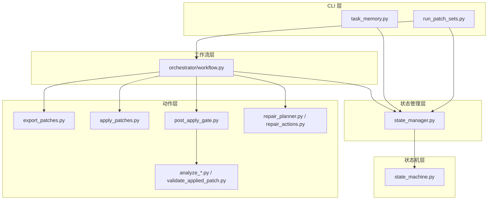

### 3.2 分层职责

- CLI 层：参数解析、模式路由、互斥检查、阻塞态保护
- 工作流层：驱动 export/apply/validate/repair/reconcile
- 状态管理层：加载、更新、事务保存、摘要生成、视图输出
- 状态机层：只负责 phase 合法性校验
- 动作层：执行 git、patch、校验和修复等具体动作

### 3.3 代码结构图

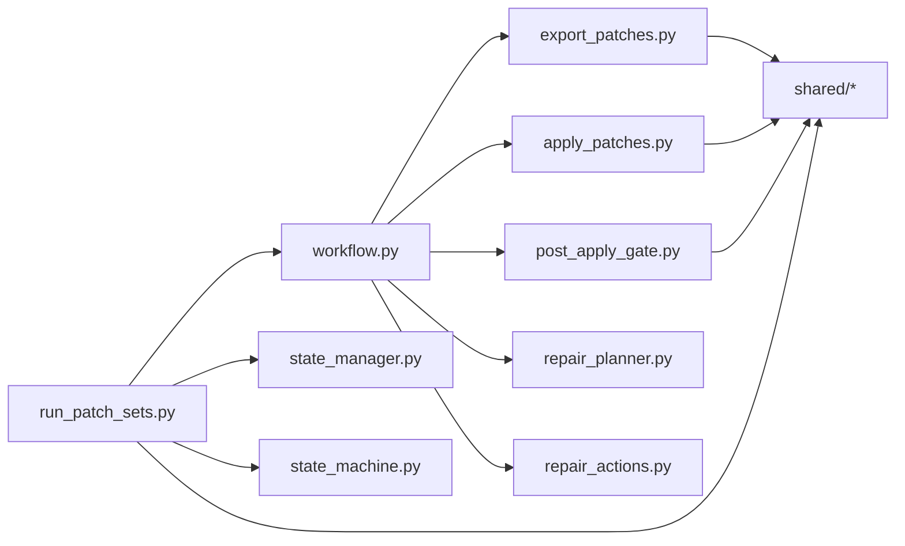

## 4. 组件模型与交互

### 4.1 核心组件图

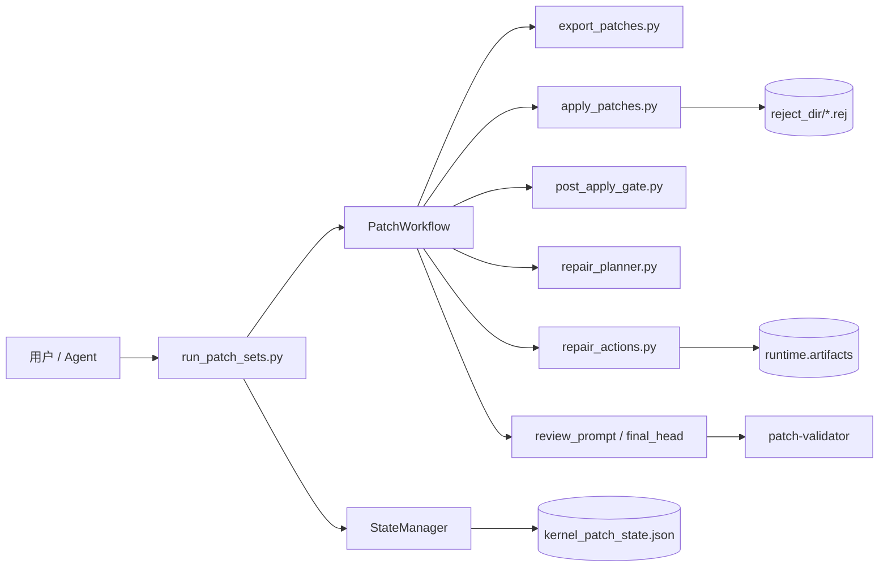

### 4.2 单补丁处理子系统

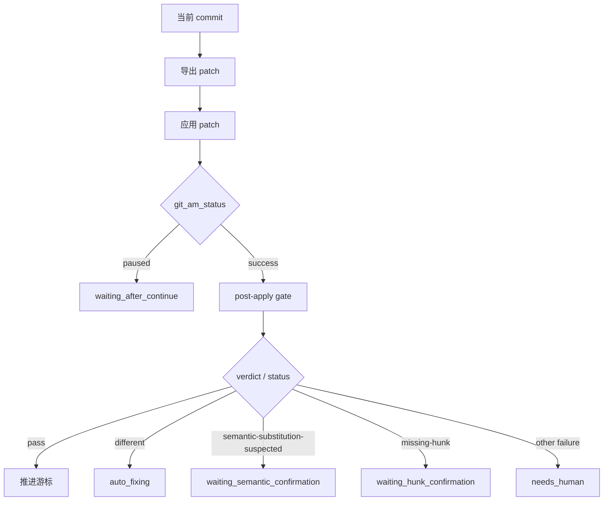

### 4.3 配置与状态交互

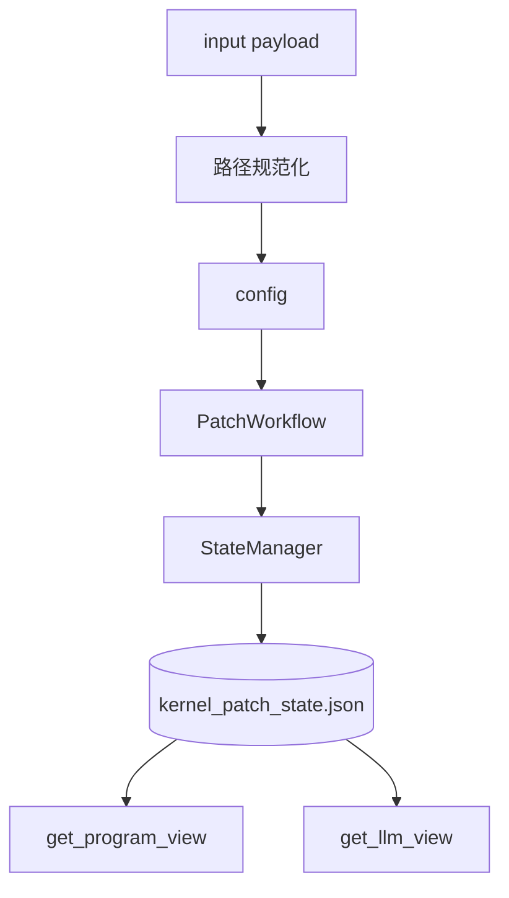

## 5. 时序与流程

### 5.1 主流程时序图

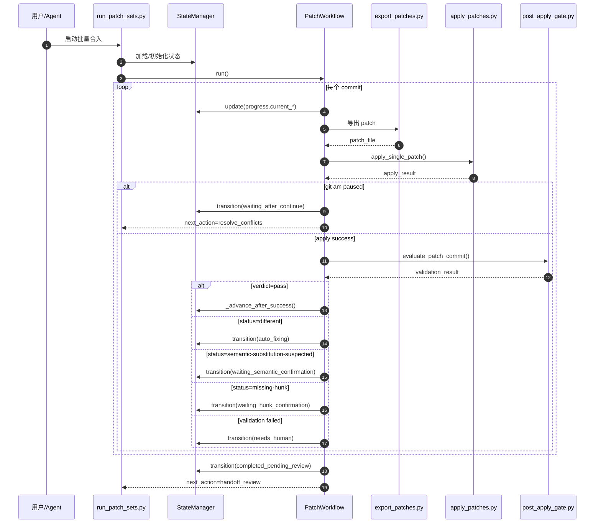

### 5.2 冲突恢复时序图

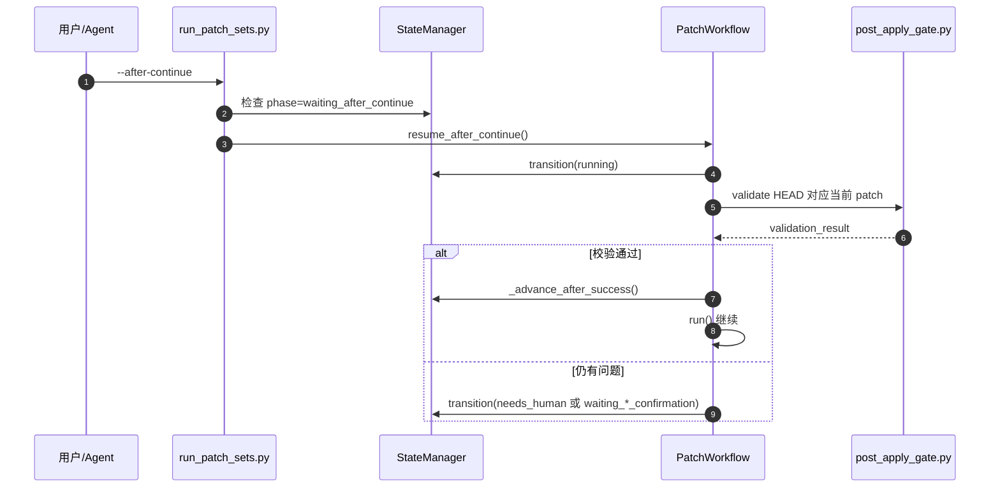

### 5.3 自动修复循环图

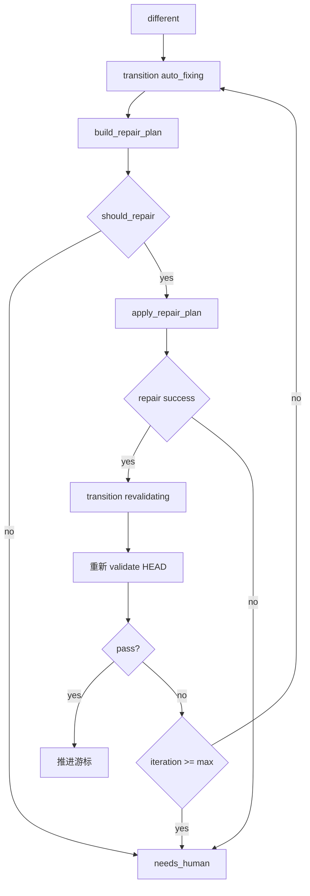

### 5.4 Reconcile 流程图

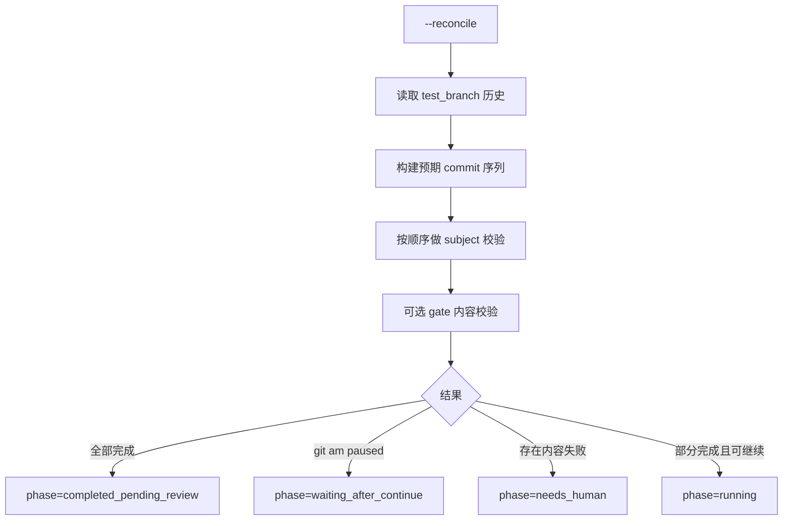

### 5.5 人工决策恢复图

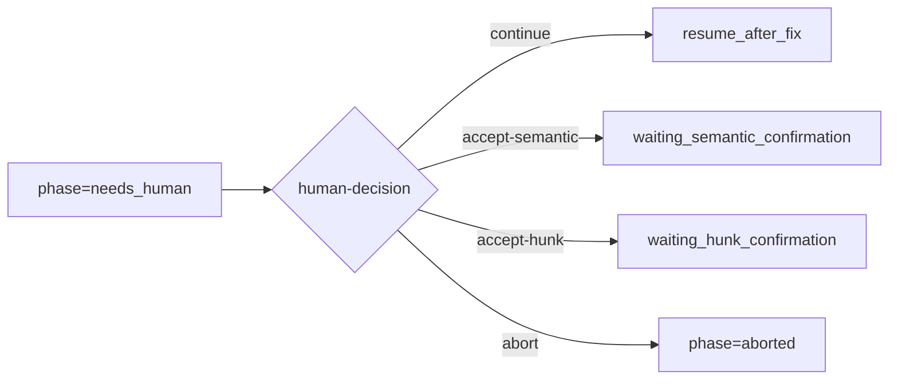

## 6. 状态机与恢复模型

### 6.1 状态集合

- `idle`
- `running`
- `revalidating`
- `auto_fixing`
- `waiting_after_continue`
- `waiting_semantic_confirmation`
- `waiting_hunk_confirmation`
- `completed_pending_review`
- `needs_human`
- `aborted`
- `ended`

### 6.2 状态机图

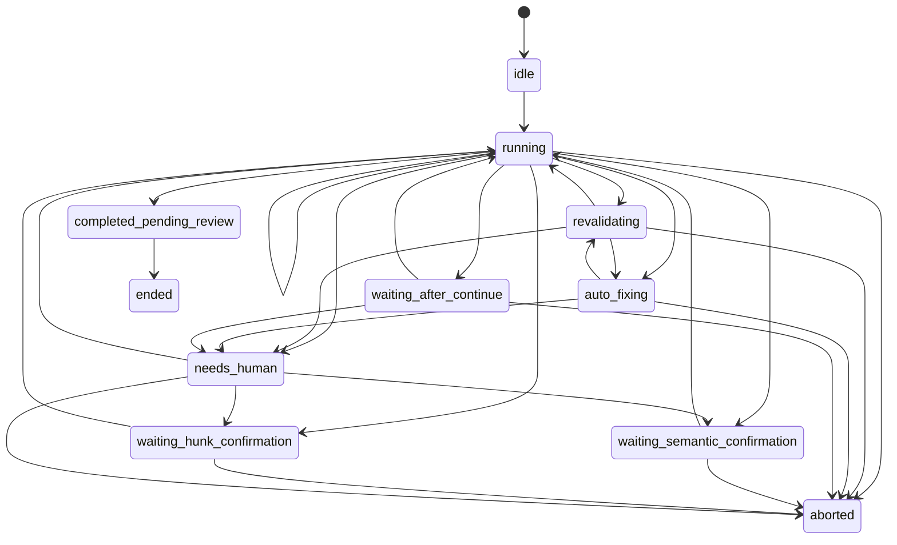

### 6.3 状态分类图

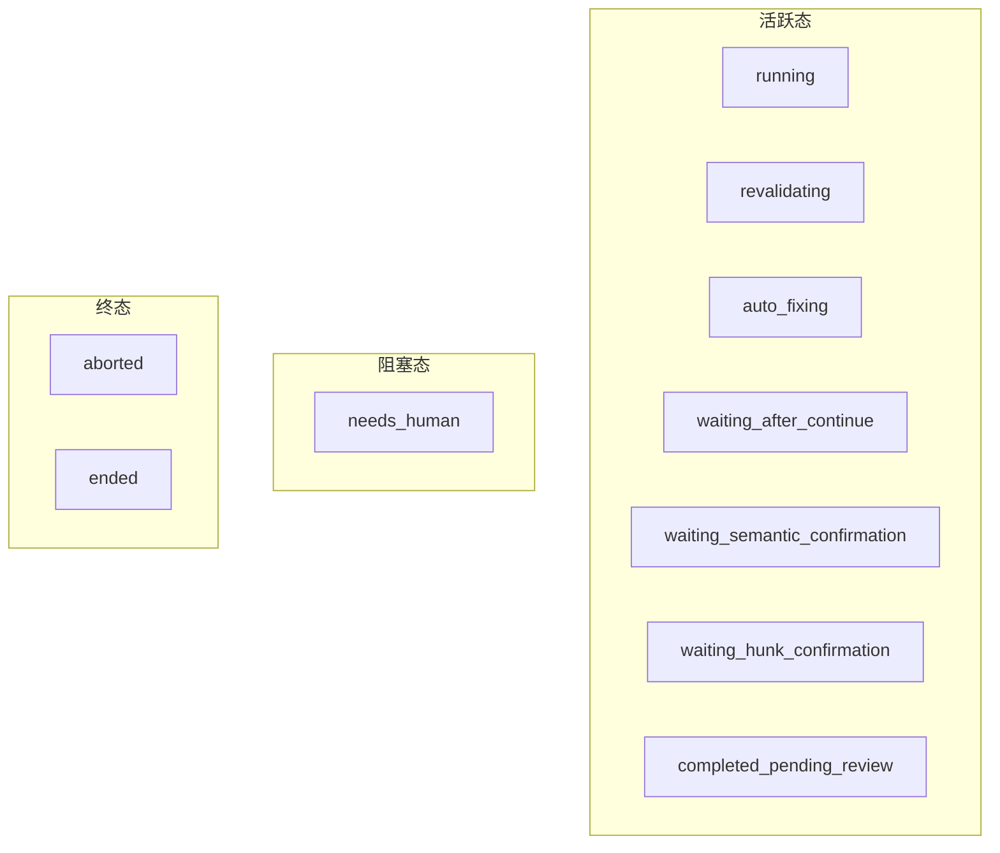

### 6.4 状态文件结构图

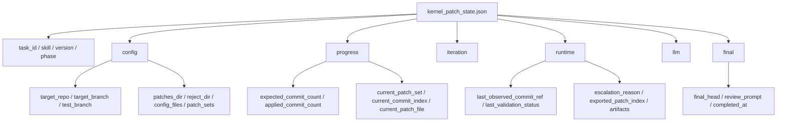

### 6.5 一致性约束

- phase 转移必须通过 `StateMachine.can_transition()`
- 成功路径统一走 `_advance_after_success()`，保证 `applied_commit_count` 与游标同步
- `needs_human` 状态下 fresh run 会被阻断，只能显式恢复
- `resume_after_fix()` 要求 HEAD 相比 `last_observed_commit_ref` 已变化

## 7. 脚本职责说明

### 7.1 核心脚本矩阵

| 脚本 | 职责 |
|------|------|
| `scripts/run_patch_sets.py` | 主入口、模式分发、phase 门控、阻塞态保护 |
| `scripts/orchestrator/workflow.py` | 主循环、恢复流程、自动修复、reconcile |
| `scripts/orchestrator/state_manager.py` | state 读写、事务保存、摘要与视图生成 |
| `scripts/orchestrator/state_machine.py` | phase 枚举、转移规则、phase 分类 |
| `scripts/post_apply_gate.py` | 统一 post-apply 校验入口 |
| `scripts/validate_applied_patch.py` | patch 与 commit diff 级比较 |
| `scripts/apply_patches.py` | 执行 `git am`，处理 `.rej` 和 test_branch |
| `scripts/export_patches.py` | 从源仓库导出 patch |
| `scripts/task_memory.py` | inspect、mark-ended、mark-aborted |

### 7.2 单补丁执行职责分解图

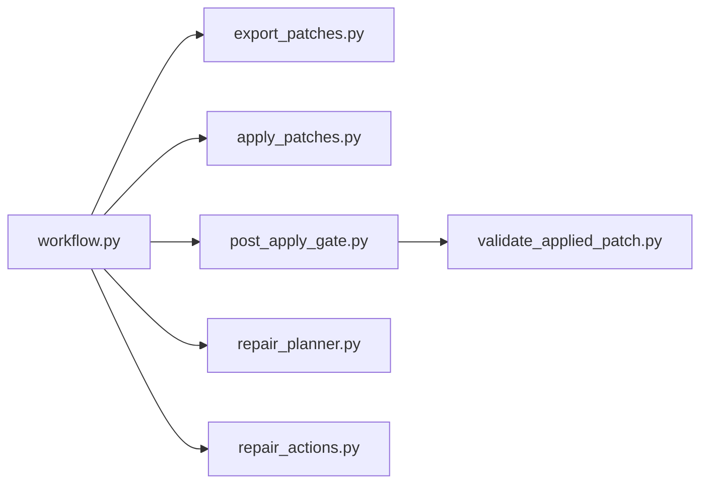

## 8. 数据契约

### 8.1 输入契约

```json
{
  "target_repo": "/path/to/repo",
  "target_branch": "main",
  "reject_dir": "/path/to/rejects",
  "patches_dir": "/path/to/patches",
  "config_files": [],
  "patch_sets": [
    {
      "name": "set0",
      "source_repo": "/path/to/source",
      "commits": ["abc123", "def456"]
    }
  ],
  "max_iteration_per_patch": 4
}
```

### 8.2 输出契约示意

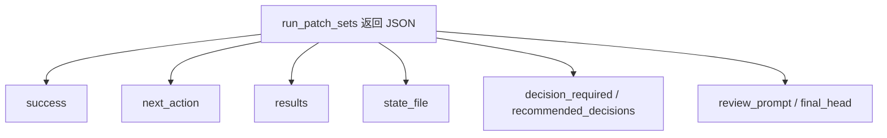

### 8.3 常见 `next_action`

- `resolve_conflicts`
- `continue_git_am`
- `confirm_semantic_substitution`
- `confirm_hunk_recovery`
- `escalate_human`
- `handoff_review`
- `stop_invalid_input`
- `stop_manual_recovery_required`

### 8.4 配置映射图

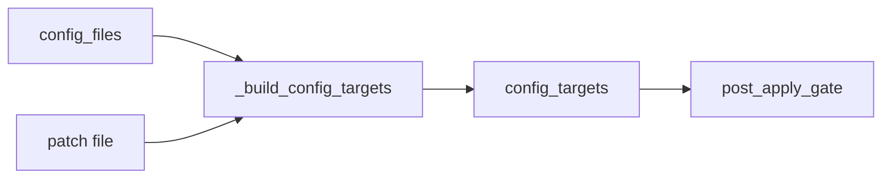

## 9. 测试与运维说明

### 9.1 测试覆盖

| 测试文件 | 覆盖重点 |
|---------|---------|
| `test_state_machine.py` | 状态枚举、转移规则、phase 分类 |
| `test_state_manager.py` | 状态初始化、嵌套更新、摘要生成 |
| `test_run_patch_sets_after_continue.py` | `needs_human` 保护、`--after-continue`、`--human-decision` |
| `test_loop_controller.py` | 自动重试决策 |
| `test_workflow_config_targets.py` | config target 构建 |
| `test_post_apply_gate.py` | gate 结果解释与 artifact 写入 |

运行命令：

```bash
python3 -m unittest discover -s kernel-patch/tests -p 'test_*.py'
```

### 9.2 运维建议

- 优先读取 `kernel_patch_state.json` 排查问题
- 优先用 `--reconcile` 对齐状态，而不是手改 state
- 保留 `patches_dir`、`reject_dir` 和 `runtime.artifacts` 作为恢复与取证依据
- review 阶段不要跳过 `patch-validator`

### 9.3 总结

当前实现的 `kernel-patch` 架构具有三个核心特征：

1. 批量 orchestrator、状态管理和恢复入口全部收敛，降低了中断恢复复杂度。
2. patch 生命周期被拆成明确阶段，自动路径和人工路径分界清晰。
3. 合入并不是终点，系统天然把最终一致性校验交接给 `patch-validator`。
