# Patch-Validator 设计文档

## 目录

- [1. 设计概述](#1-设计概述)
- [2. 架构驱动因素](#2-架构驱动因素)
- [3. 分层架构](#3-分层架构)
- [4. 组件模型与交互](#4-组件模型与交互)
- [5. 时序与流程](#5-时序与流程)
- [6. 匹配与比较模型](#6-匹配与比较模型)
- [7. 脚本职责说明](#7-脚本职责说明)
- [8. 数据契约](#8-数据契约)
- [9. 测试与运维说明](#9-测试与运维说明)

## 1. 设计概述

`patch-validator` 是一个用于分析 `git format-patch` 结果的校验器，支持两类问题：

1. 这些 patch 还能否应用到目标分支。
2. 这些 patch 是否已经以等价 diff 的形式合入目标仓库。

系统既可单独用于 patch 预检查，也可作为 `kernel-patch` 批量迁移后的复核组件。

### 1.1 双模式定位图

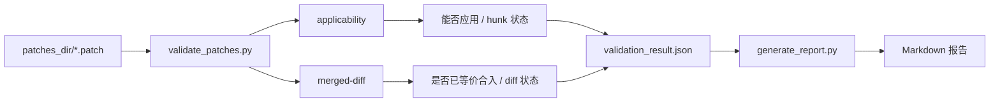

### 1.2 当前实现边界

- 单一主脚本 `scripts/validate_patches.py` 承载解析、匹配、比较和 CLI
- 报告渲染与校验计算分离
- 目标提交匹配顺序固定为 `subject-strict -> subject-fuzzy -> diff`
- 对二进制 / 非 UTF-8 diff 不做文本逐行比较，而是显式降级

## 2. 架构驱动因素

### 2.1 业务驱动

- patch 迁移前需要尽早判断可应用性
- patch 迁移后需要判断“已合入”是否真等价，而不是只比标题
- 大批量 patch 审查需要结构化 JSON 和可读报告双产物
- 用户提供的 patch 文件名可能截断，匹配逻辑必须更稳健

### 2.2 技术驱动

- 解析层要同时支持 `unidiff` 和手工解析兜底
- 匹配层要能限制搜索范围，避免全历史扫描成本过高
- 比较层要能识别新增缺失、额外新增和删除侧不一致
- 输出层要为自动化和人工审查分别提供 JSON 与 Markdown

### 2.3 约束图

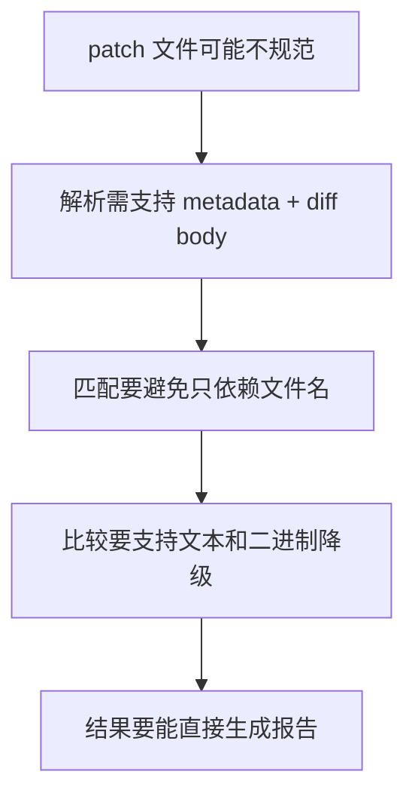

## 3. 分层架构

### 3.1 分层图

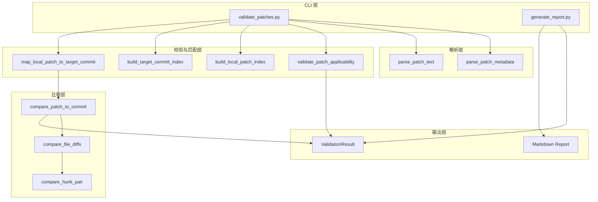

### 3.2 分层职责

- CLI 层：参数解析、模式切换、输出落盘
- 解析层：提取 patch metadata、文件 diff 和 hunk
- 校验与匹配层：执行 applicability 校验或构建本地/目标索引并匹配提交
- 比较层：做文件级和 hunk 级差异分析
- 输出层：聚合统计并生成 JSON / Markdown

## 4. 组件模型与交互

### 4.1 核心组件图

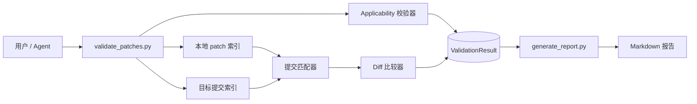

### 4.2 Applicability 子系统图

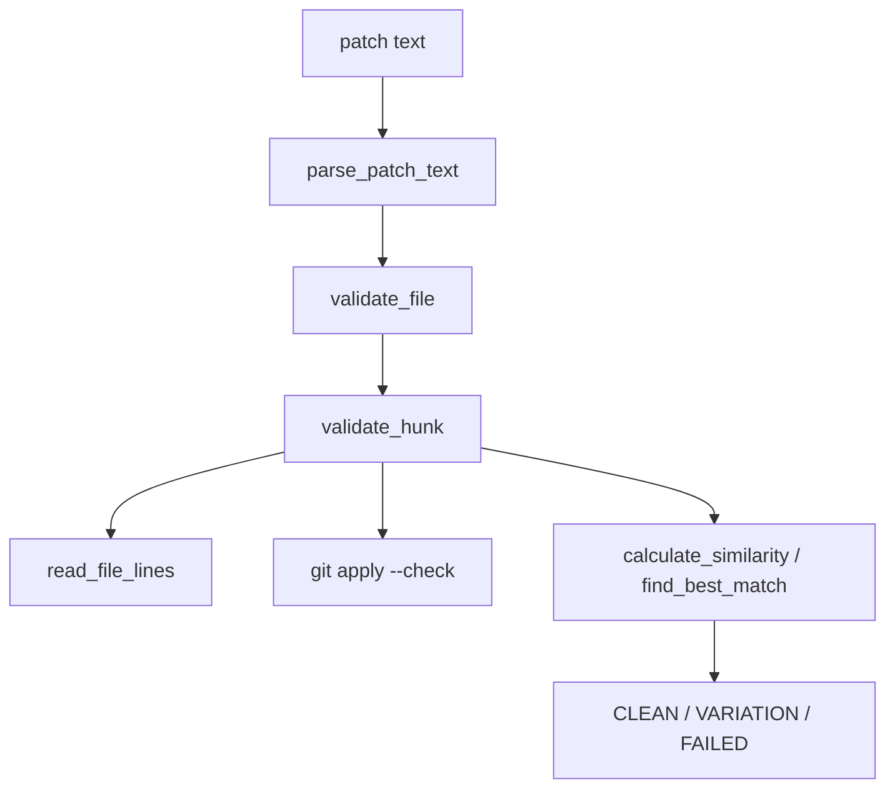

### 4.3 Merged-Diff 子系统图

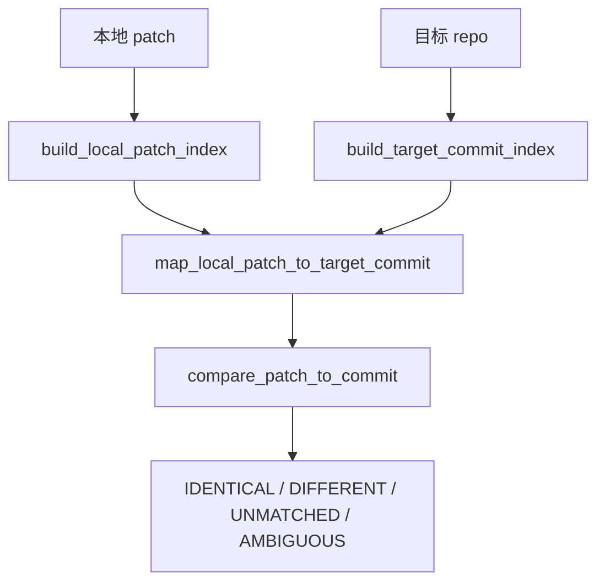

## 5. 时序与流程

### 5.1 Applicability 时序图

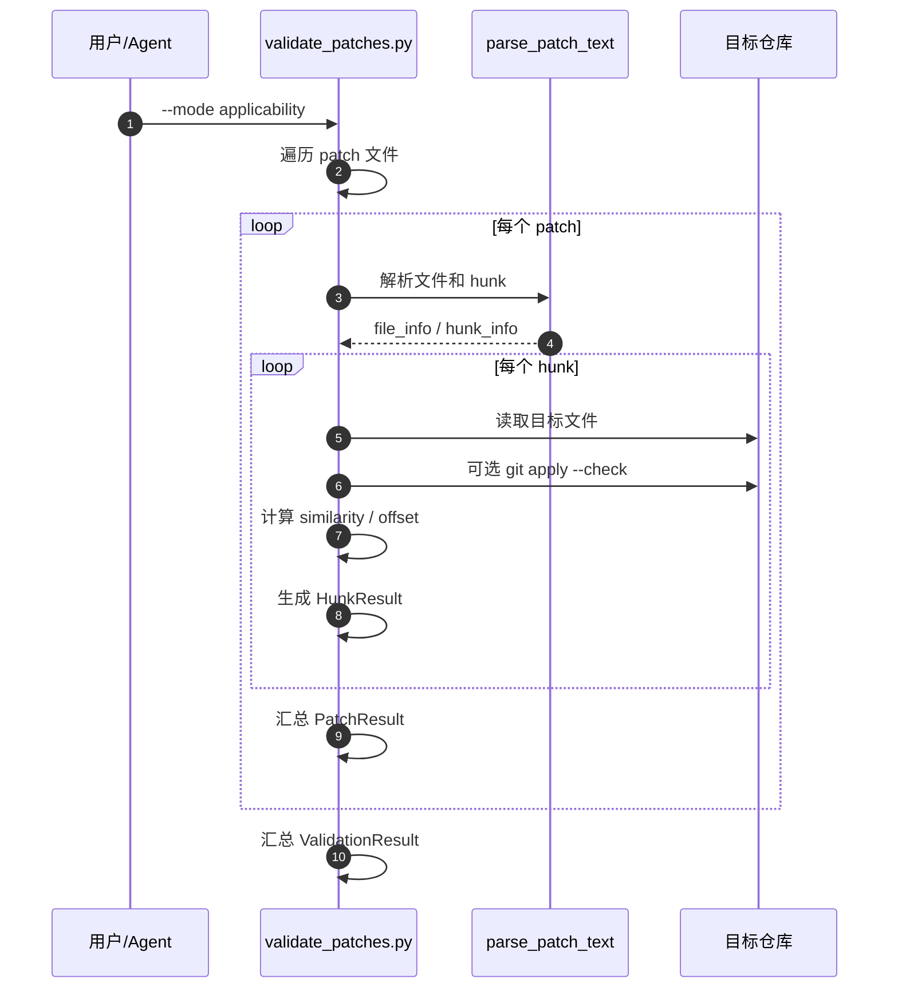

### 5.2 Merged-Diff 时序图

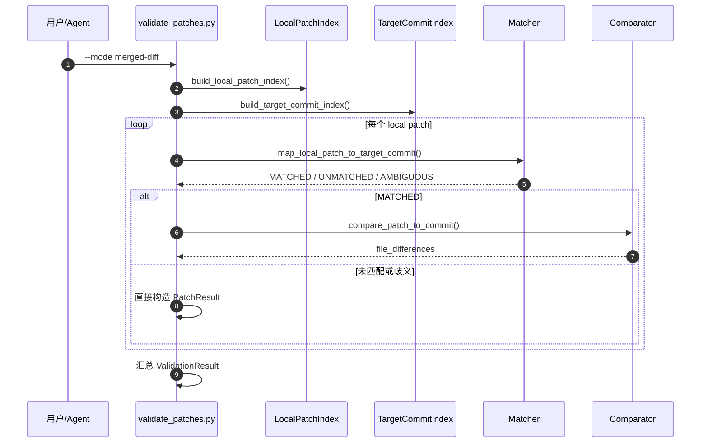

### 5.3 搜索范围流程图

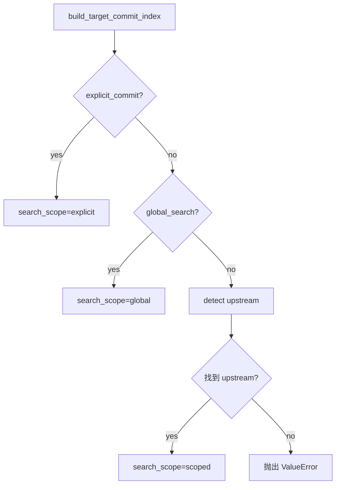

### 5.4 报告生成流程图

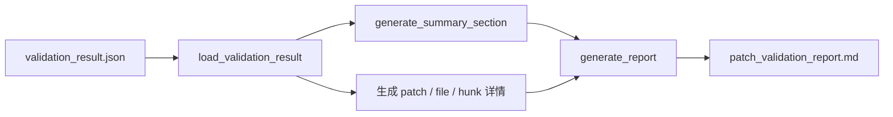

## 6. 匹配与比较模型

### 6.1 状态模型

#### Applicability 状态

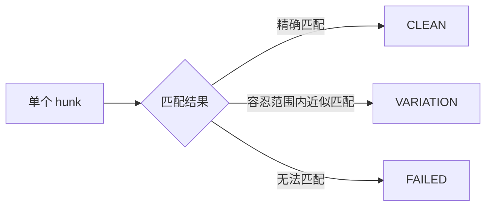

#### Merged-Diff 状态

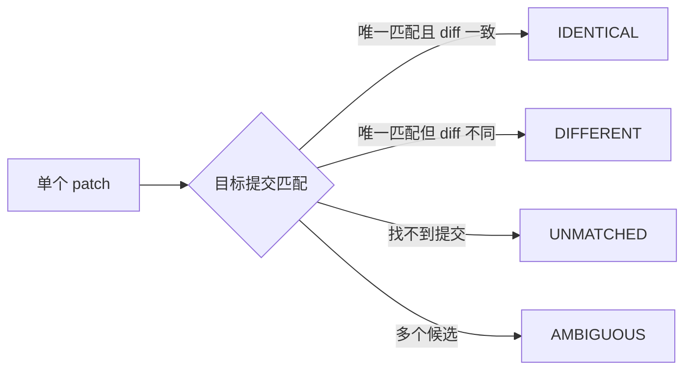

### 6.2 匹配优先级图

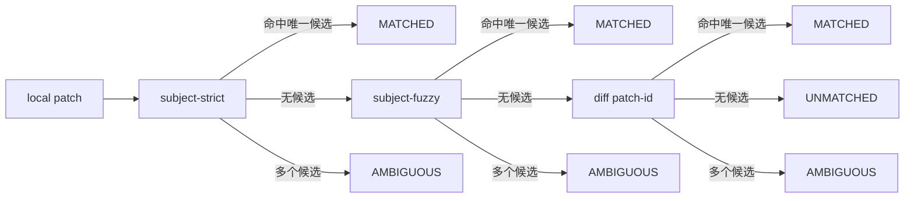

### 6.3 本地 patch 身份提取图

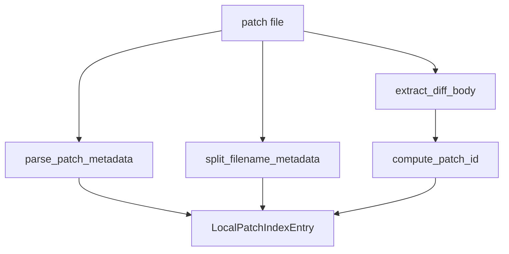

### 6.4 差异比较图

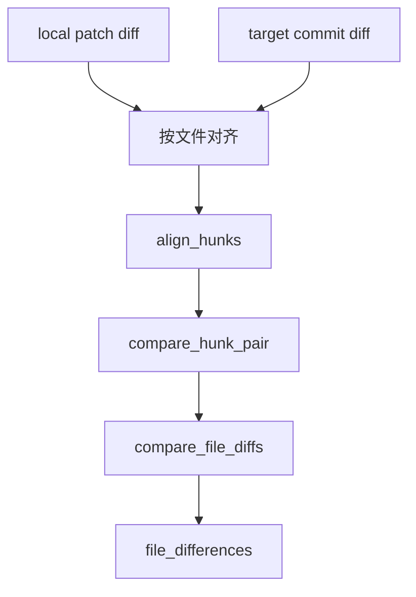

### 6.5 特殊场景说明

- `Subject:` 折行时会拼接 continuation line，避免截断匹配失败
- 文件名明显截断时，不直接判定“文件不存在”，而是优先走 `Subject -> From hash -> diff`
- 二进制或非 UTF-8 diff 会返回 `skipped` 文件级状态，不做文本逐行比较

## 7. 脚本职责说明

### 7.1 脚本矩阵

| 脚本 | 职责 |
|------|------|
| `scripts/validate_patches.py` | 主 CLI、patch 解析、适用性校验、提交匹配、diff 比较 |
| `scripts/generate_report.py` | 将 JSON 结果转成 Markdown 报告 |
| `references/report_template.md` | 报告阅读模板与术语说明 |

### 7.2 主脚本内部模块关系

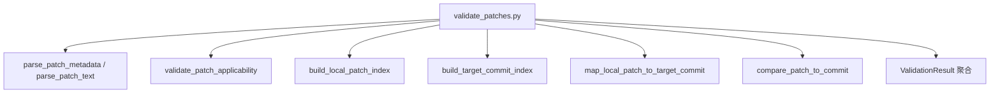

## 8. 数据契约

### 8.1 CLI 输入图

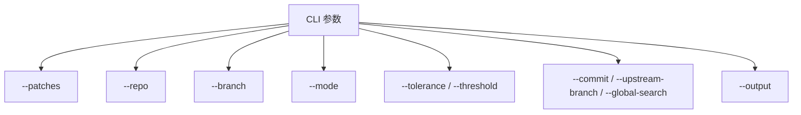

### 8.2 结果模型图

```mermaid
flowchart TD
    VR[ValidationResult]
    VR --> V1[repository / branch / mode]
    VR --> V2[match_strategy / search_scope / upstream_branch]
    VR --> V3[patches[]]
    VR --> V4[total_patches / total_hunks]
    VR --> V5[identical / different / unmatched / ambiguous]

    V3 --> PR[PatchResult]
    PR --> P1[patch_file / commit_subject / commit_hash]
    PR --> P2[files / file_differences]
    PR --> P3[overall_status / diff_status]
    PR --> P4[target_match_status / target_match_method]
```

### 8.3 JSON 输出示例

```json
{
  "repository": "/path/to/repo",
  "branch": "main",
  "mode": "merged-diff",
  "match_strategy": "subject-strict->subject-fuzzy->diff",
  "search_scope": "global",
  "patches": [
    {
      "patch_file": "0001-demo.patch",
      "commit_subject": "demo subject",
      "diff_status": "IDENTICAL",
      "target_match_status": "MATCHED",
      "target_match_method": "subject-strict"
    }
  ],
  "total_patches": 1,
  "identical_patches": 1,
  "different_patches": 0,
  "unmatched_patches": 0,
  "ambiguous_patches": 0
}
```

### 8.4 报告产物图

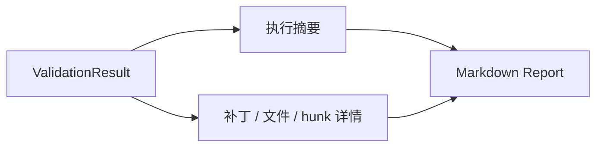

## 9. 测试与运维说明

### 9.1 测试覆盖

| 测试类别 | 覆盖重点 |
|---------|---------|
| Binary diff | `get_commit_diff_bytes()`、`compute_patch_id()`、`compare_patch_to_commit()` |
| Search scope | `explicit`、`scoped`、`global` 搜索范围 |
| Matching | `subject-strict`、`subject-fuzzy`、`diff` 三段式匹配 |

运行命令：

```bash
cd patch-validator
python3 -m unittest discover -s tests -p 'test_*.py'
```

### 9.2 运维建议

- merged-diff 默认优先 scoped 搜索，只有必要时再开 `--global-search`
- 当 patch 标题可能被截断时，先信任 patch 头，不要只看文件名
- 对 `DIFFERENT` 结果应结合 `file_differences` 与报告一起判断
- 对 `UNMATCHED` 和 `AMBIGUOUS` 结果要优先检查搜索范围是否过窄

### 9.3 总结

当前实现的 `patch-validator` 架构有三个重点：

1. 双模式分离清晰，分别服务“可应用性”与“等价合入性”两个问题。
2. 匹配与比较链路可解释，便于人工复核误判来源。
3. JSON 与 Markdown 双产物让它既能嵌入自动化流程，也能直接服务人工审查。
