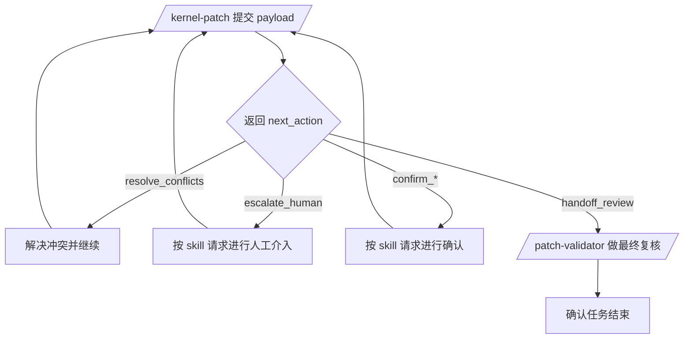

# Kernel-Patch 与 Patch-Validator 使用说明

## 目录

- [1. 适用范围](#1-适用范围)
- [2. Skill 部署指导](#2-skill-部署指导)
- [3. kernel-patch 使用说明](#3-kernel-patch-使用说明)
- [4. patch-validator 使用说明](#4-patch-validator-使用说明)
- [5. 推荐协作流程](#5-推荐协作流程)
- [6. 常见注意事项](#6-常见注意事项)

## 1. 适用范围

本说明面向两个 skill：

- `kernel-patch`：批量导出、应用、校验并恢复 patch set 合入流程
- `patch-validator`：校验 patch 是否可应用，或校验已合入 patch 与本地 patch 是否等价

这两个 skill 通常配合使用：

1. 先用 `kernel-patch` 完成批量合入阶段。
2. 再用 `patch-validator` 对测试分支做最终差异复核。

更多信息：

- 测试结论与当前限制见 `测试汇总/TEST-REPORT.md`

---

## 2. Skill 部署指导

### 2.1 常见 skill 安装目录

| 客户端 | 平台 | 常见目录 |
|------|------|---------|
| Claude | macOS | `~/Library/Application Support/Claude/skills/` |
| Claude | Linux | `~/.config/Claude/skills/` |
| Claude | Windows | `%APPDATA%\\Claude\\skills\\` |
| Gemini | macOS | `~/Library/Application Support/gemini/skills/` |
| Gemini | Linux | `~/.gemini/skills/` |
| Gemini | Windows | `%APPDATA%\\gemini\\skills\\` |
| Codex | macOS / Linux | `~/.codex/skills/` |
| Codex | Windows | `%USERPROFILE%\\.codex\\skills\\` |

### 2.2 目录结构要求

部署后建议保持以下结构：

```text
<skills_root>/
├── kernel-patch/
│   ├── SKILL.md
│   ├── scripts/
│   ├── references/
│   └── tests/
└── patch-validator/
    ├── SKILL.md
    ├── scripts/
    ├── references/
    └── tests/
```

不要只复制 `SKILL.md`，必须连同整个 skill 目录一起部署。

### 2.3 部署步骤

1. 找到当前客户端的 skill 根目录。
2. 将本仓库中的 `kernel-patch/` 和 `patch-validator/` 整个目录复制或软链接到该目录下。
3. 确认部署后存在：
   - `<skills_root>/kernel-patch/SKILL.md`
   - `<skills_root>/patch-validator/SKILL.md`
4. 重启客户端，或让客户端重新扫描 skills 目录。

### 2.4 部署后检查

- 客户端能识别 `/kernel-patch`
- 客户端能识别 `/patch-validator`
- 触发 skill 后不再提示“skill 不存在”或“找不到 SKILL.md”

---

## 3. kernel-patch 使用说明

### 3.1 适用场景

适用于以下任务：

- 将一组上游 commit 批量迁移到目标内核分支
- 保留 patch 顺序执行 patch set
- 在冲突后恢复 `git am --continue`
- 在需要时由 skill 主动发起人类确认

### 3.2 输入要点

`kernel-patch` 的主输入是一个批量 payload。常用字段：

- `target_repo`：目标仓库路径
- `target_branch`：目标分支
- `reject_dir`：保存 `.rej` 备份的目录
- `patches_dir`：导出 patch 和状态文件的目录
- `config_files`：配置映射目标文件列表
- `patch_sets`：按顺序执行的补丁集列表

注意：

- payload 中的字段名是 `config_files`
- `patch_sets[].commits` 必须按希望合入的顺序排列

### 3.3 通用调用示例

下面是更通用的 skill 调用模板，可直接替换成你的实际路径和提交列表：

```text
/kernel-patch 帮我合入补丁，信息如下：
{
  "target_repo": "/path/to/target-repo",
  "target_branch": "target-branch",
  "reject_dir": "/path/to/reject-dir",
  "patches_dir": "/path/to/patches-dir",
  "config_files": [
    "/path/to/target-repo/config.aarch64",
    "/path/to/target-repo/config.aarch64-64k"
  ],
  "patch_sets": [
    {
      "name": "feature-series-name",
      "source_repo": "/path/to/source-repo",
      "commits": [
        "commit_sha_1",
        "commit_sha_2",
        "commit_sha_3"
      ]
    }
  ]
}
```

### 3.4 多补丁集示例

```text
/kernel-patch 帮我按顺序合入两个 patch set，信息如下：
{
  "target_repo": "/path/to/target-repo",
  "target_branch": "stable-branch",
  "reject_dir": "/path/to/reject-dir",
  "patches_dir": "/path/to/patches-dir",
  "config_files": [],
  "patch_sets": [
    {
      "name": "base-series",
      "source_repo": "/path/to/source-repo-a",
      "commits": [
        "sha_a1",
        "sha_a2"
      ]
    },
    {
      "name": "followup-series",
      "source_repo": "/path/to/source-repo-b",
      "commits": [
        "sha_b1",
        "sha_b2"
      ]
    }
  ]
}
```

### 3.5 返回结果如何处理

`kernel-patch` 内部状态机状态：

- `resolve_conflicts`：说明 `git am` 暂停，需要处理冲突
- `confirm_semantic_substitution`：需要确认语义替代
- `confirm_hunk_recovery`：需要确认 missing hunk 的处理方式
- `escalate_human`：自动修复无法收敛，需要人工介入
- `handoff_review`：合入阶段完成，应该拉起 `patch-validator`

使用原则：

- `kernel-patch` 是自动化补丁合入 skill，正常情况下应由它持续推进
- 只有当 skill 无法自动决策时，才会主动向人类发起确认或请求介入
- 在没有收到 skill 明确请求前，不需要主动做额外的人工修复分支操作

### 3.6 冲突后的继续方式

如果返回 `resolve_conflicts`，标准流程是：

1. 在目标仓库解决冲突。
2. 执行 `git add -A`。
3. 执行 `git am --continue`。
4. 再次调用 `kernel-patch`，要求继续当前任务。

通用提示语示例：

```text
/kernel-patch 我已经解决冲突并执行了 git am --continue，请继续当前任务。
```

### 3.7 结束信号

只有当 `kernel-patch` 返回 `next_action: "handoff_review"` 时，才表示“合入阶段完成”。这时不要直接宣布任务结束，而是把返回的 `review_prompt` 原样交给 `patch-validator`。

---

## 4. patch-validator 使用说明

### 4.1 适用场景

适用于以下任务：

- 检查 patch 是否还能应用到目标分支
- 检查测试分支上的已合入提交是否与本地 patch 等价
- 为 patch 集生成结构化校验报告

### 4.2 最常见用法

和 `kernel-patch` 配合时，最常见的是检查测试分支与 patch 目录是否存在差异。

通用调用示例：

```text
/patch-validator 帮我检查一下 /path/to/target-repo 的分支 auto-patch-YYYYMMDD_HHMMSS 合入的补丁，与 /path/to/patches-dir 里的补丁是否存在差异。
```

更抽象一点的表达也可以：

```text
/patch-validator 帮我检查目标仓库测试分支和本地 patch 目录是否完全一致，并指出有差异的补丁。
```

### 4.3 应用校验示例

如果你要检查 patch 是否还能应用到某个分支，可以这样描述：

```text
/patch-validator 帮我检查 /path/to/patches-dir 里的 patch 是否还能应用到 /path/to/target-repo 的 target-branch 分支。
```

### 4.4 已合入差异校验示例

如果你要检查“已经合入的 patch 与本地 patch 是否等价”，可以这样描述：

```text
/patch-validator 帮我检查 /path/to/target-repo 的 test-branch 分支中已合入的补丁，与 /path/to/patches-dir 中的 patch 是否存在差异。
```

### 4.5 输出如何解读

`patch-validator` 常见结果：

- `IDENTICAL`：本地 patch 与目标提交 diff 完全一致
- `DIFFERENT`：已找到对应提交，但 diff 内容有差异
- `UNMATCHED`：找不到对应提交
- `AMBIGUOUS`：找到多个候选提交，无法安全自动判断

对于 applicability 模式，常见 hunk 状态：

- `CLEAN`
- `VARIATION`
- `FAILED`

### 4.6 与 kernel-patch 的衔接

如果 `kernel-patch` 返回了 `review_prompt`，推荐直接原样使用，不要改写仓库路径、测试分支或 patch 目录。

标准衔接方式如下：

```text
/patch-validator 帮我检查一下 /path/to/target-repo 的分支 auto-patch-YYYYMMDD_HHMMSS 合入的补丁，与 /path/to/patches-dir 的补丁是否存在差异。
```

---

## 5. 推荐协作流程

### 5.1 端到端流程

```text
1. 调用 /kernel-patch 提交批量 payload
2. 如果冲突，先解决冲突并继续当前任务
3. 如果 skill 主动请求确认，再按提示响应
4. 当 /kernel-patch 返回 handoff_review
5. 使用返回的 review_prompt 调用 /patch-validator
6. 只有 patch-validator 完成后，才认为整个迁移任务结束
```

### 5.2 流程图



## 6. 常见注意事项

### 6.1 kernel-patch

- 不要手工批量 `git am`
- 不要手工编辑状态文件同步进度
- 不要跳过 skill 要求的恢复步骤
- 不要在批量流程中自行省略冲突处理和 review 阶段

### 6.2 patch-validator

- 不要只靠截断的 patch 文件名判断匹配结果
- 对 `UNMATCHED` 先检查搜索范围或目标分支是否正确
- 对 `DIFFERENT` 需要结合具体差异判断是否可接受

### 6.3 路径填写建议

- 尽量使用绝对路径
- `patches_dir` 和 `reject_dir` 最好提前创建
- `target_repo` 和 `source_repo` 必须是有效 git 仓库路径

### 6.4 字段命名注意

- payload 中用 `config_files`
- 不要在 JSON payload 中写成 `config-files`
